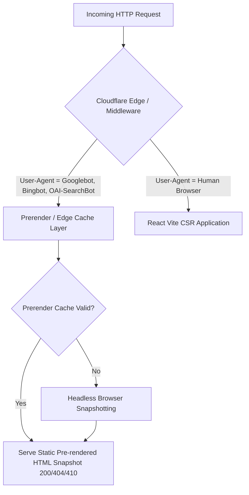

OBSOLETE — SUPERSEDED BY CURRENT FRONTEND ARCHITECTURE

# Metro Mitra — Master Crawler Policy & Active-Only Indexation Specification

> **Entity:** Metro Mitra (Operated by Parther Technologies Pvt. Ltd., CIN: `U62099WR2026PTC293183`, Barrackpore, West Bengal)  
> **Target Properties:** `metromitra.com` / `workforce.gomytruck.com` (`workforce_web`)  
> **Status:** MANDATORY ENGINEERING SPECIFICATION  
> **Compliance:** Google Search Essentials (March 2024 Scaled Content & Doorway Policy), Bing Webmaster Guidelines, OpenAI Bot Directives, IndexNow Protocol  

---

## 1. Executive Mandate & Strategic Objectives

Metro Mitra is an on-demand blue-collar and logistics workforce platform operating in India. To establish dominant organic search and Generative Engine Optimization (GEO) authority while mitigating brand entity collision (with the Bengaluru transit initiative) and eliminating programmatic doorway risks, Metro Mitra enforces strict crawler governance and database-backed Active-Only indexing rules.

### Core Objectives:
1. **AI Discoverability (GEO):** Explicitly permit and optimize for real-time AI citation and search bots (`OAI-SearchBot`, `PerplexityBot`, `Bingbot`, `Googlebot`).
2. **Proprietary Data Protection:** Restrict non-retrieval LLM scrapers (`GPTBot`, `CCBot`, `Google-Extended`) from uncredited foundational model training.
3. **Crawl Budget & Anti-Doorway Protection:** Disallow internal search facets, sorting parameters, API paths, and unauthenticated/private worker data.
4. **Active-Only Indexing Policy:** Programmatically prune empty location/role permutations via HTTP 404/410 status codes and dynamic sitemap pruning to guarantee zero thin-content or phantom-job indexation.

---

## 2. Bot Classification & Crawler Matrix

| Bot / User-Agent | Operator | Type | Access Level | Strategic Rationale |
|---|---|---|---|---|
| `Googlebot` | Google | Traditional Search Engine | **ALLOW ALL** | Primary organic search indexation |
| `Googlebot-Image` | Google | Image Indexing | **ALLOW (Assets)** | CDN image indexing for rich snippets |
| `Bingbot` | Microsoft | Search Engine / Copilot | **ALLOW ALL** | Microsoft Copilot & Bing search indexation |
| `OAI-SearchBot` | OpenAI | Real-Time AI Search | **ALLOW ALL** | Powers ChatGPT Search citations and real-time answers |
| `OAI-AdsBot` | OpenAI | Ad / Landing Verification | **ALLOW ALL** | Validates platform landing pages for conversational ad units |
| `PerplexityBot` | Perplexity | Real-Time AI Search | **ALLOW ALL** | Perplexity AI search citation and grounding |
| `GPTBot` | OpenAI | LLM Model Training Scraper | **DISALLOW ALL** | Protects workforce data from offline model training |
| `CCBot` | Common Crawl | Open Web Scraper | **DISALLOW ALL** | Blocks third-party bulk dataset scraping |
| `Google-Extended` | Google | Gemini / Bard Training | **DISALLOW ALL** | Prevents AI training ingestion while Googlebot remains allowed |
| `Anthropic-ai` / `ClaudeBot` | Anthropic | AI Scraper / Crawler | **DISALLOW ALL** | Blocks uncredited LLM training scraping |
| `Bytespider` | ByteDance | AI Scraper | **DISALLOW ALL** | Aggressive scraping protection |
| `*` (Default Fallback) | All Others | Generic Crawlers | **RESTRICTED** | Allows standard public paths; blocks query params and internal endpoints |

---

## 3. Production `robots.txt` Specification

The following file must be deployed at `https://metromitra.com/robots.txt`. The build script (`scripts/generate-sitemap.js`) must **never** overwrite this file.

```txt
# ==============================================================================
# Metro Mitra — Production robots.txt
# Operated by Parther Technologies Pvt. Ltd. (CIN: U62099WR2026PTC293183)
# ==============================================================================

# ------------------------------------------------------------------------------
# 1. Search Engine & Real-Time AI Search Crawlers (Full Crawl Access)
# ------------------------------------------------------------------------------
User-agent: Googlebot
User-agent: Bingbot
User-agent: OAI-SearchBot
User-agent: OAI-AdsBot
User-agent: PerplexityBot
Allow: /
Disallow: /api/
Disallow: /app/
Disallow: /private/
Disallow: /worker-profile/
Disallow: /employer-dashboard/
Disallow: /search
Disallow: /*?*q=
Disallow: /*?*sort=
Disallow: /*?*filter=
Disallow: /*?*page=
Disallow: /*.json$

# ------------------------------------------------------------------------------
# 2. Image Crawlers (Asset Indexation)
# ------------------------------------------------------------------------------
User-agent: Googlebot-Image
User-agent: BingPreview
Allow: /*.png$
Allow: /*.jpg$
Allow: /*.jpeg$
Allow: /*.webp$
Allow: /*.svg$
Disallow: /api/
Disallow: /private/

# ------------------------------------------------------------------------------
# 3. LLM Training & Heavy Scrapers (Restricted from Proprietary Scrape)
# ------------------------------------------------------------------------------
User-agent: GPTBot
User-agent: CCBot
User-agent: Google-Extended
User-agent: ClaudeBot
User-agent: Anthropic-ai
User-agent: Bytespider
Disallow: /

# ------------------------------------------------------------------------------
# 4. Default Rules for All Other Bots
# ------------------------------------------------------------------------------
User-agent: *
Allow: /
Disallow: /api/
Disallow: /app/
Disallow: /private/
Disallow: /worker-profile/
Disallow: /employer-dashboard/
Disallow: /search
Disallow: /*?*q=
Disallow: /*?*sort=
Disallow: /*?*filter=
Disallow: /*?*utm_*
Disallow: /*?*fbclid*

# ------------------------------------------------------------------------------
# 5. Sitemaps
# ------------------------------------------------------------------------------
Sitemap: https://metromitra.com/sitemap-index.xml
```

---

## 4. Technical Rendering & Dynamic Middleware Architecture

Metro Mitra's frontend is built with React/Vite (CSR). To guarantee flawless parsing, prevent client-side JavaScript execution timeouts, and ensure optimal Core Web Vitals (LCP/CLS):



### Server-Side Rendering (SSR) & Dynamic Snapshot Directives:
1. **Dynamic User-Agent Interception**: Middleware must detect user-agents `Googlebot`, `Bingbot`, `OAI-SearchBot`, `PerplexityBot`.
2. **Head Tag Integrity**: The served snapshot must contain fully populated `<head>` elements:
   - Canonical URL (`<link rel="canonical" href="..." />`) strictly pointing to self without tracking params.
   - Comprehensive JSON-LD (`Organization`, `WebSite`, `BreadcrumbList`, `JobPosting`, `Service`).
   - Meta robot directives (`<meta name="robots" content="index, follow" />` or `noindex, nofollow`).
3. **HTTP Response Codes**: Never serve HTTP 200 with an empty body or client-side "No jobs found" redirect. The server header itself must transmit `404 Not Found` or `410 Gone`.

---

## 5. Active-Only Indexation Policy (Anti-Spam & Anti-Doorway)

Under Google's March 2024 Scaled Content Abuse system (*QualityCopiaFireflySiteSignal*), programmatic URL generation with placeholder or static copy is classified as spam.

### 5.1 The Evidence-First Verification Rule
A programmatic page (`/jobs/[role]/[location]/` or `/hire-workers/[service]/[location]/`) is **ONLY eligible for indexation** if the backend database verifies all of the following minimum thresholds:

| Metric | Minimum Threshold | Action if Below Threshold |
|---|---|---|
| **Active Live Jobs** | $\ge 1$ verified, non-expired opening | Return HTTP 404 or `X-Robots-Tag: noindex, nofollow` |
| **Registered Worker Supply** | $\ge 5$ verified KYC workers in zone | Omit page from programmatic sitemaps |
| **Local Wage Data** | Verified localized wage range | Mark wage fields explicitly as "Platform Average Estimate" |
| **Verified Physical Cluster** | Validated industrial park or logistics zone | Do NOT fabricate street addresses or fake GBPs |

### 5.2 Page Status Lifecycle & HTTP Directives

```
[Job Created / Active]  ───────> HTTP 200 (index, follow + JobPosting JSON-LD + In Sitemap)
         │
         ▼ (Job Filled / Expired)
[Job Expired (validThrough past)] ──> HTTP 410 (Gone) + Remove from Sitemap + Push to IndexNow
         │
         ▼ (Category Becomes Empty)
[0 Active Jobs in Hub] ───> HTTP 404 / noindex + Exclude from Sitemap
```

1. **Active State (HTTP 200)**: Page meets active criteria; included in sitemap; full Schema.org markup.
2. **Expired Job Details (HTTP 410 Gone)**:
   - When a job's `validThrough` date passes or the position is filled, the detail page `/jobs/detail/[id]/` must immediately return `HTTP 410 Gone` (or 301 redirect to the parent category `/jobs/[role]/[location]/`).
   - The JobPosting schema must never remain live with an expired date without past `validThrough`.
3. **Inactive Hubs / Zero Supply (HTTP 404 / noindex)**:
   - If a geographic permutation has zero live jobs and zero worker availability, the route must return `404 Not Found` or emit `<meta name="robots" content="noindex, nofollow" />` and `X-Robots-Tag: noindex, nofollow`.

---

## 6. Sitemap Architecture & Multi-Partition Specification

Sitemaps must be dynamically generated via cron or backend trigger, decoupling static pages from high-frequency job feeds.

### 6.1 Sitemap Index Structure (`sitemap-index.xml`)
```xml
<?xml version="1.0" encoding="UTF-8"?>
<sitemapindex xmlns="http://www.sitemaps.org/schemas/sitemap/0.9">
  <sitemap>
    <loc>https://metromitra.com/sitemap-core.xml</loc>
    <lastmod>2026-08-19T00:00:00Z</lastmod>
  </sitemap>
  <sitemap>
    <loc>https://metromitra.com/sitemap-roles.xml</loc>
    <lastmod>2026-08-19T00:00:00Z</lastmod>
  </sitemap>
  <sitemap>
    <loc>https://metromitra.com/sitemap-locations.xml</loc>
    <lastmod>2026-08-19T00:00:00Z</lastmod>
  </sitemap>
  <sitemap>
    <loc>https://metromitra.com/sitemap-jobs-active.xml</loc>
    <lastmod>2026-08-19T12:00:00Z</lastmod>
  </sitemap>
  <sitemap>
    <loc>https://metromitra.com/sitemap-b2b.xml</loc>
    <lastmod>2026-08-19T00:00:00Z</lastmod>
  </sitemap>
</sitemapindex>
```

### 6.2 Partition Governance:
1. **`sitemap-core.xml`**: Homepage, `/about`, `/contact`, `/terms`, `/privacy`. Priority `1.0 - 0.7`. Updated only upon site structural changes.
2. **`sitemap-roles.xml`**: Top-level role guide hubs (`/jobs/warehouse-helper/`, `/jobs/loading-worker/`). Priority `0.8`.
3. **`sitemap-locations.xml`**: Active Tier 1 & Tier 2 location hubs meeting active threshold (`/jobs/kolkata/`, `/jobs/dankuni/`). Priority `0.8`.
4. **`sitemap-jobs-active.xml`**: Dynamic XML containing only active, non-expired individual job postings (`/jobs/detail/[job-id]/`). Generated every 2 hours.
5. **`sitemap-b2b.xml`**: Employer hiring pillars (`/hire-workers/`, `/hire-workers/logistics/dankuni/`). Priority `0.9`.

### 6.3 `lastmod` Timestamp Rules:
- The `<lastmod>` tag must represent the **actual last modification date** of that specific entity in the database.
- It must **never** be generated using `new Date().toISOString()` across all pages simultaneously.

---

## 7. Real-Time IndexNow Integration (Bing / Yandex)

To ensure sub-minute indexation and immediate removal of expired job postings without waiting for passive sitemap crawls:

```javascript
// IndexNow API Trigger Specification (POST https://api.indexnow.org/indexnow)
{
  "host": "metromitra.com",
  "key": "METRO_MITRA_INDEXNOW_KEY",
  "keyLocation": "https://metromitra.com/METRO_MITRA_INDEXNOW_KEY.txt",
  "urlList": [
    "https://metromitra.com/jobs/detail/kol-wh-84920",
    "https://metromitra.com/jobs/warehouse-helper/dankuni/"
  ]
}
```
- **Trigger on Job Publish**: Push URL list immediately to IndexNow API.
- **Trigger on Job Expiry**: Push expired URL to IndexNow immediately alongside returning HTTP 410.

---

## 8. Entity Disambiguation & Schema Enforcement

To eliminate Knowledge Graph collision with the Bengaluru transit auto-rickshaw project, all indexed pages must embed explicit Organization linked data:

```json
{
  "@context": "https://schema.org",
  "@type": "Organization",
  "@id": "https://metromitra.com/#organization",
  "name": "Metro Mitra",
  "legalName": "Parther Technologies Private Limited",
  "identifier": "CIN: U62099WR2026PTC293183",
  "url": "https://metromitra.com",
  "logo": "https://metromitra.com/metromitra-logo.png",
  "address": {
    "@type": "PostalAddress",
    "streetAddress": "Chiriyamore",
    "addressLocality": "Barrackpore",
    "addressRegion": "West Bengal",
    "postalCode": "700120",
    "addressCountry": "IN"
  },
  "knowsAbout": [
    "Gig Workforce Marketplace",
    "Blue-Collar Staffing",
    "Warehouse Logistics Labor",
    "e-Shram Compliant Workforce"
  ]
}
```

---

## 9. Implementation Checklist for `workforce_web`

- [ ] **Decouple `robots.txt` from `generate-sitemap.js`**: Remove the `fs.writeFileSync(robots.txt)` block in `generate-sitemap.js`.
- [ ] **Deploy Strict `robots.txt`**: Place the multi-bot rule block in `public/robots.txt`.
- [ ] **Implement Active-Only Filtering in Sitemap Generator**: Query database / active data source to omit 0-job / 0-worker locations.
- [ ] **Partition Sitemaps**: Split single `sitemap.xml` into `sitemap-index.xml` and granular topic sitemaps.
- [ ] **Configure Prerender / Edge Worker Middleware**: Intercept `Googlebot`, `Bingbot`, `OAI-SearchBot`, `PerplexityBot` and serve full pre-rendered HTML with intact `<head>` and schemas.
- [ ] **Enforce 410 Gone on Expired Jobs**: Ensure expired IDs return HTTP 410 and ping IndexNow API.
