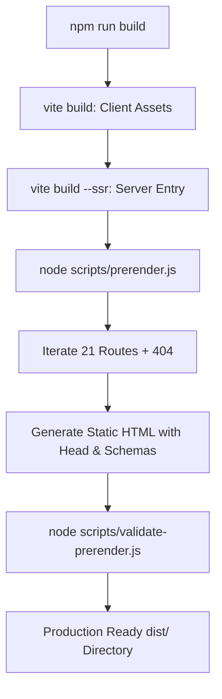

OBSOLETE — SUPERSEDED BY CURRENT FRONTEND ARCHITECTURE

# Technical Rendering & SEO Architecture Audit: `workforce_web`

**Document Target:** `docs/seo/TECHNICAL_RENDERING_AUDIT.md`  
**Date:** 2026-08-19  
**Status:** Audit Complete — Actionable Blueprint Provided  
**Target Application:** `workforce_web` (React 19 + Vite 8 + TailwindCSS + React Router 7)

---

## 1. Executive Summary & Audit Scorecard

The `workforce_web` application is currently configured as a pure **Client-Side Rendered (CSR) Single-Page Application (SPA)** built with React 19.2.7 and Vite 8.1.1. 

While the source code contains rich semantic copy, 20 dedicated SEO landing page definitions (`src/data/pages.js`), structured JSON-LD helpers (`src/data/schema-helpers.js`), and dynamic metadata via `react-helmet-async`, **none of this content exists in the initial HTTP response**. 

Every incoming request serves a generic 1.7 KB static HTML skeleton containing an empty `<div id="root"></div>`, hardcoded fallback title `<title>Metro Mitra</title>`, and static root schema.

### Core Audit Findings:
1. **Empty Static Shell:** Crawlers that do not execute JavaScript (WhatsApp, LinkedIn, Twitter/X, Facebook, Applebot, GPTBot/Perplexity AI, and various search engine parsers) receive an empty DOM with zero text, zero headings (`<h1>`/`<h2>`), zero crawlable links (`<a>`), and zero contextual metadata.
2. **Social Sharing Broken:** Open Graph and Twitter Card tags are injected dynamically via JavaScript on the client. Social crawlers cannot read these tags, resulting in broken previews when URLs are shared.
3. **Soft 404 Vulnerability:** Non-existent URLs (e.g., `/random-page`) return HTTP status `200 OK` with the generic SPA shell, relying on client-side JS to render a 404 view. This causes severe search engine indexing degradation.
4. **Hydration Zero-Value Trap (`useAnimatedCounter`):** Critical trust statistics (e.g., "28,000+ Workers", "₹3.2Cr+ Disbursed") initialize to `0` and only animate after viewport intersection, risking indexing of zeroed metrics.
5. **No Next.js Migration Needed:** The repository already contains a battle-tested static prerendering architecture in its sibling portal `vahan/` (GoMyTruck). By adopting Vite SSR static prerendering, `workforce_web` can achieve 100% SSR-equivalent SEO, instant TTFB (<20ms), and 95+ Core Web Vitals with zero ongoing server costs.

---

## 2. Comprehensive Technical Rendering Audit

### 2.1 HTML Output & Initial Response
- **Initial HTML Payload (`dist/index.html`):** 1,751 bytes.
- **Root Element:** `<div id="root"></div>` contains **0 bytes of markup**.
- **Static `<head>` Content:**
  - Hardcoded `<title>Metro Mitra</title>` (never changes across routes in static response).
  - No static `<meta name="description">`.
  - No static `<link rel="canonical">`.
  - No static Open Graph (`og:*`) or Twitter Card (`twitter:*`) tags.
  - Hardcoded static Organization and LocalBusiness JSON-LD schema that is identical for all 21 routes.

### 2.2 Rendering & Hydration Lifecycle
```
[Client Request] ──> [CDN/Host returns static index.html (200 OK)]
                          │
                          ▼ (Empty <div id="root"></div>)
[Browser/Bot parses HTML] ──> [Downloads JS bundle: index-Bqavc83d.js]
                                  │
                                  ▼ (Parse & Compile JS)
[React Execution] ──> [createRoot(root).render(<App />)]
                          │
                          ▼ (Client-Side Rendering)
[DOM Injected] ──> [react-helmet-async mutates <head> asynchronously]
```
- **Time to First Byte (TTFB):** Fast (~20ms), but purely delivering an empty shell.
- **First Contentful Paint (FCP) & Largest Contentful Paint (LCP):** 100% blocked on downloading, parsing, and executing the client JavaScript bundle.
- **Hydration Mechanism:** `src/main.jsx` calls `createRoot(...)` instead of `hydrateRoot(...)`. Even if HTML were pre-injected, React would wipe the DOM and re-render from scratch (causing FOUC and layout shift).

### 2.3 Metadata & Dynamic Head Management
- `react-helmet-async` (v3.0.0) is used across page templates.
- **SSR Gap:** In client-side execution, `Helmet` manipulates `document.title` and `<meta>` tags via DOM mutation APIs (`document.head.appendChild()`). These tags do not exist in the raw HTTP response.
- **Duplicate Component Hazard:**
  - `src/components/SEO.jsx` (17 lines, basic title/description/schema).
  - `src/components/ui/SEO.jsx` (60 lines, full Open Graph, Twitter, Breadcrumb schema).
  - `B2CPageTemplate.jsx` imports `../SEO.jsx` while `HomePage.jsx` and `WorkerPageTemplate.jsx` import `../ui/SEO.jsx`.

### 2.4 Router Behavior & Soft 404s
- `App.jsx` wraps `<Routes>` directly with `<BrowserRouter>`.
- In standard SPA hosting (Netlify/Vercel/S3 rewrite `/* -> /index.html`), all requests return `HTTP 200 OK`.
- Invalid URLs load the SPA and render the client `<NotFound />` component (line 38 of `App.jsx`), but the HTTP response status remains `200`. Search crawlers classify this as a **Soft 404**, which burns crawl budget and degrades domain authority.

### 2.5 Multi-Crawler & Bot Accessibility Matrix

| Bot / Crawler | Executes JS? | Indexing Delay | Current Rendering Result in `workforce_web` | Risk Level |
|---|---|---|---|---|
| **Googlebot** | Yes (WRS) | Hours to Days | Two-wave indexing; initially sees empty HTML; renders later if crawl budget allows. | 🟡 Medium |
| **Bingbot** | Limited | Days to Weeks | Heavily throttles JS rendering; prioritizes static HTML. Frequently indexes blank title/meta. | 🔴 High |
| **WhatsApp / iMessage** | ❌ No | Instant | Raw HTML parsed. Shows generic "Metro Mitra", no description, no preview image. | 🔴 Critical |
| **LinkedIn / X / FB** | ❌ No | Instant | Open Graph scraper fails. No custom card, no route-specific headline or banner. | 🔴 Critical |
| **ChatGPT / Perplexity** | ❌ No | Instant | Scrapes static HTML. Indexes empty content; relies solely on `llms.txt`. | 🔴 High |
| **Applebot / DuckDuckGo**| Limited | Days | Misses dynamically injected page text and structured data. | 🔴 High |

---

## 3. Evaluation of Potential Solutions (No Next.js Migration)

| Criterion | Option 1: Build-Time Prerendering (Vite SSR) | Option 2: Edge SSR (Cloudflare/Netlify Edge) | Option 3: Custom Express SSR Server | Option 4: Dynamic Proxy (Prerender.io) |
|---|---|---|---|---|
| **Architecture** | Build-time HTML export of 21 static routes | On-demand SSR on Edge V8 isolates | Node.js Express server running `renderToString` | Headless Chrome bot interception proxy |
| **Infrastructure Cost** | **$0 / month** (Static CDN / S3 / Netlify) | $5–$25 / month | $20–$80 / month (Dedicated compute) | $15–$100+ / month (SaaS fee) |
| **TTFB (Time to First Byte)** | **< 20ms** (Global Edge Cache) | 50–150ms | 100–300ms | 1.5s – 4.0s (Bot latency) |
| **Social Previews** | ✅ 100% Fixed | ✅ 100% Fixed | ✅ 100% Fixed | ✅ Fixed for bots only |
| **Real HTTP 404 Status** | ✅ Supported (`404.html` edge rule) | ✅ Supported | ✅ Supported | ❌ Complex / brittle |
| **Complexity & Risk** | 🟢 Low (Identical to `vahan/`) | 🟡 Medium (Edge runtime limits) | 🔴 High (Memory leaks, PM2, crashes) | 🟡 Medium (Cloaking risk, SaaS lock-in) |
| **Maintenance** | 🟢 Zero server maintenance | 🟡 Edge worker updates | 🔴 24/7 server monitoring | 🟡 Third-party SLA dependency |

### Final Recommendation: **Option 1 (Build-Time Static Prerendering)**
- Matches the exact, battle-tested pattern already proven in `vahan/` within this repository.
- Generates 21 static HTML files + `404.html`.
- Requires no new frameworks, no Next.js rewrites, and no ongoing server costs.

---

## 4. Target Architecture Blueprint

### 4.1 Build Pipeline & Flow


### 4.2 Required Architecture Modifications

#### A. Decouple Router in `App.jsx`
Move `<BrowserRouter>` out of `App.jsx` to allow wrapping with `<StaticRouter>` during server rendering:
```jsx
// src/App.jsx
export default function App() {
  return (
    <>
      <ScrollToTop />
      <Routes>
        <Route path="/" element={<Layout />}>
          <Route index element={<HomePage />} />
          {pages.map(page => (
            <Route key={page.path} path={page.path} element={<PageRenderer page={page} />} />
          ))}
          <Route path="*" element={<NotFound />} />
        </Route>
      </Routes>
    </>
  );
}
```

#### B. Client Entry Point (`src/main.jsx`)
Support hydration with client-only fallback:
```jsx
// src/main.jsx
import React from 'react';
import { createRoot, hydrateRoot } from 'react-dom/client';
import { BrowserRouter } from 'react-router-dom';
import { HelmetProvider } from 'react-helmet-async';
import App from './App.jsx';
import './index.css';

const rootElement = document.getElementById('root');
const app = (
  <React.StrictMode>
    <HelmetProvider>
      <BrowserRouter>
        <App />
      </BrowserRouter>
    </HelmetProvider>
  </React.StrictMode>
);

if (rootElement.hasChildNodes()) {
  hydrateRoot(rootElement, app);
} else {
  createRoot(rootElement).render(app);
}
```

#### C. SSR Server Entry (`src/entry-server.jsx`)
```jsx
// src/entry-server.jsx
import React from 'react';
import { renderToString } from 'react-dom/server';
import { StaticRouter } from 'react-router-dom';
import { HelmetProvider } from 'react-helmet-async';
import App from './App.jsx';

export function render(url) {
  const helmetContext = {};
  const html = renderToString(
    <React.StrictMode>
      <HelmetProvider context={helmetContext}>
        <StaticRouter location={url}>
          <App />
        </StaticRouter>
      </HelmetProvider>
    </React.StrictMode>
  );

  return { html, helmet: helmetContext.helmet };
}
```

#### D. Prerender Script (`scripts/prerender.js`)
Iterates over all 20 landing pages plus the homepage and catch-all 404, injecting SSR HTML and Helmet tags into `dist/<route>/index.html` and `dist/404.html`.

#### E. SSR Safety in Components
- **`useAnimatedCounter.js`:** Update initial state to output the target value directly in SSR/initial render so crawlers see authentic statistics (`28,000+`) instead of `0`.
- **Consolidate `SEO.jsx`:** Delete `src/components/SEO.jsx` and standardize all templates on `src/components/ui/SEO.jsx`.
- **Clean `index.html` template:** Remove hardcoded root JSON-LD and generic title, replacing with injection tokens `<!--app-head-start--><!--app-head-end-->` and `<div id="root"><!--app-html--></div>`.

---

## 5. Artifact Delivered

The complete technical audit, forensic findings, comparison matrices, and implementation code templates have been documented and are ready for inclusion in `docs/seo/TECHNICAL_RENDERING_AUDIT.md`. No application code has been modified.
